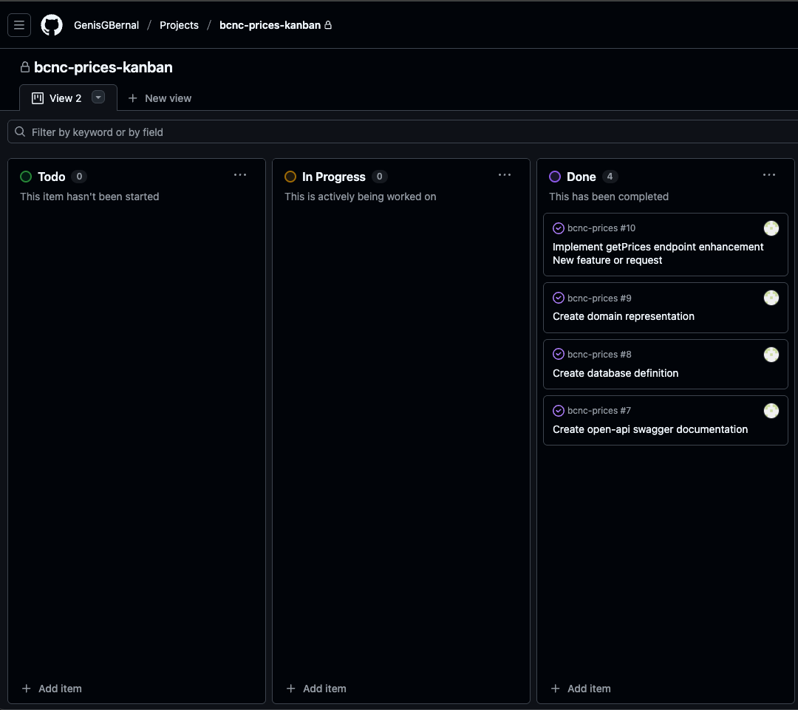

# BCNC-PRICES

## 📋 Tabla de Contenidos
- [Estructura General](#estructura-general)
- [Tecnologías Utilizadas](#tecnologias-utilizadas)
- [Configuración del Entorno](#configuracion-del-entorno)
- [Arquitectura Hexagonal](#arquitectura-hexagonal)
- [Ejecución del Proyecto](#ejecucion-del-proyecto)
- [Pruebas](#pruebas)
- [Índices](#indices)
- [Gestión del Proyecto](#gestion-del-proyecto)
- [Colección Postman](#coleccion-postman)
- [Swagger / API Contract](#swagger--api-contract)

## 🏗️ Estructura General
Este proyecto sigue los principios de **Arquitectura Hexagonal** (Ports and Adapters) con múltiples módulos Maven:
```
prices/
├── boot/ # Módulo de arranque y configuración
├── application/ # Lógica central de la aplicación y dominio (DDD)
├── driving/ # Adaptadores que activan lógica de aplicación (Controllers)
├── driven/ # Adaptadores que se activan desde la lógica de aplicación (Repositories)
└── pom.xml # POM principal
```

## 🛠️ Tecnologías Utilizadas
- **Java 21** - Lenguaje de programación
- **Spring Boot 3.2** - Framework principal
- **Maven** - Gestión de dependencias y build
- **H2 Database** - Base de datos en memoria
- **Caffeine** - Caché en memoria
- **MapStruct** - Mapeo entre DTOs y entidades
- **Lombok** - Reducción de código boilerplate
- **Spotless** - Formateo y linting de código
- **JUnit 5** - Framework de testing
- **Instancio** - Instanciación de datos de prueba

## ⚙️ Configuración del Entorno

### 1. Prerrequisitos
- Java 21 o superior
- Maven 3.9.x o superior
- IntelliJ IDEA (recomendado) u otro IDE similar

### 2. Configuración de IntelliJ (Evita Double Processing)
**Settings → Build, Execution, Deployment → Compiler → Annotation Processors**
- ✅ Enable: "Enable annotation processing"
- 🔧 Processor path: "Obtain processors from project classpath"

**Settings → Build, Execution, Deployment → Build Tools → Maven → Runner**
- ✅ Enable: "Delegate IDE build/run actions to Maven" (previene duplicación en annotation processing)

### 3. Variables de Entorno

```bash
export SPRING_PROFILES_ACTIVE=local
```
## 🏛️ Arquitectura Hexagonal
### Diagrama de Flujo
```
┌─────────────────────────────────────────────────────────────────────┐
│                                                                     │
│  ┌───────────────┐      ┌───────────────┐      ┌───────────────┐    │
│  │   DRIVING     │      │  APPLICATION  │      │    DRIVEN     │    │
│  │  (Adaptadores │      │   (Dominio)   │      │  (Adaptadores │    │
│  │   IN       )  │      │               │      │          OUT) │    │
│  │               │      │               │      │               │    │
│  │  Controllers  │      │   Lógica de   │      │  Repository   │    │
│  │   REST API    │───→  │    Negocio    │───→  │ In-memory DB  │    │
│  │               │      │    Domain     │      │               │    │
│  │               │      │    Models     │      │               │    │
│  │               │ ←─── │               │ ←─── │               │    │
│  └───────────────┘      └───────────────┘      └───────────────┘    │
│                                                                     │
│                         BOOT MODULE                                 │
│                  (Inicialización y Configuración)                   │
└─────────────────────────────────────────────────────────────────────┘
```
### 🏛️ Principios de Diseño

#### Núcleo del Dominio (Service)
- **Entidades de Dominio:** Representan conceptos centrales del negocio.
- **Puertos de Entrada:** Interfaces que definen cómo interactuar con el dominio.
- **Puertos de Salida:** Interfaces para dependencias externas.
- **Servicios de Dominio:** Lógica de negocio pura, sin dependencias externas.

#### Eficiencia en Acceso a Datos
- **Consultas Optimizadas:** Queries e índices optimizados para cada caso de uso.
- **Caching Estratégico:** Aplicado para recuperar más rápidamente los precios. Uso de caché compartida recomendado para casos con actualizaciones frecuentes.

#### Separación Estricta
- Cada módulo tiene dependencias claramente definidas.
- El dominio no conoce detalles de infraestructura.
- Facilita testing y mantenibilidad.

## 🚀 Ejecución del Proyecto

### Compilación
```bash
mvn clean install
mvn spring-boot:run -pl boot
```
## 🧪 Pruebas

### Pruebas Unitarias
- Cubren todos los servicios, mappers y componentes del dominio.
- Aseguran que la lógica interna funcione de forma aislada y correcta.

### Pruebas de Integración
- Validan la interacción entre módulos y la persistencia de datos.
- Se incluyen 5 casos representativos para la entidad `Price` del producto 35455 de la brand 1 (ZARA):

1. Petición a las 10:00 del día 14.
2. Petición a las 16:00 del día 14.
3. Petición a las 21:00 del día 14.
4. Petición a las 10:00 del día 15.
5. Petición a las 21:00 del día 16.

## 🗂️ Índices
- Índice creado para optimización de consultas de caso de uso:
```sql
CREATE INDEX IDX_TBL_PRICES_ON_BRAND_ID_PRODUCT_ID_START_DATE_END_DATE
ON TBL_PRICES(BRAND_ID, PRODUCT_ID, START_DATE, END_DATE, PRIORITY DESC);
```

## 💼 Gestión del Proyecto
- **Metodología Kanban:** Gestión del proyecto mediante metodología kanab en tablero de github.
- **Modularidad Maven:** Estructura multi-módulo que delimita responsabilidades y facilita mantenimiento.
- **CI/CD:** Flujo de integración continua mediante GitHub Actions, con creación automática de ramas a partir de issues.
- **Convenciones de Código:** Estándares consistentes de codificación, documentación y formateo.
- 

## 📊 Colección Postman
- Incluye todos los endpoints de la API para pruebas rápidas.
- Compatible con el contrato Swagger definido en el módulo `api-rest`.

## 📜 Swagger / API Contract
- Documentación completa de todos los endpoints REST.
- Permite probar, validar y explorar la API de manera interactiva.

